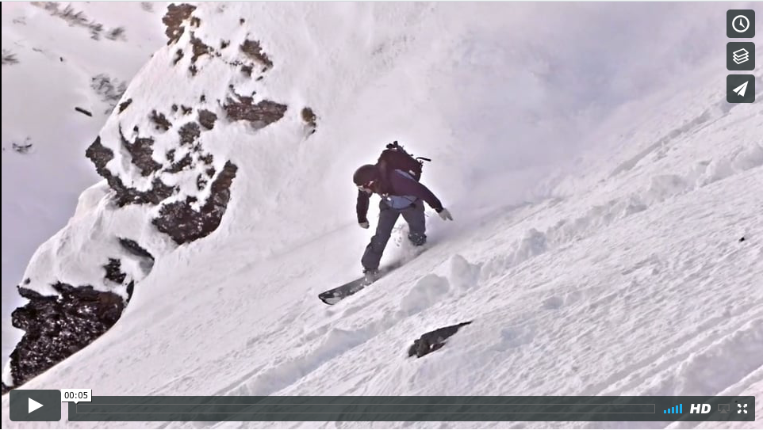
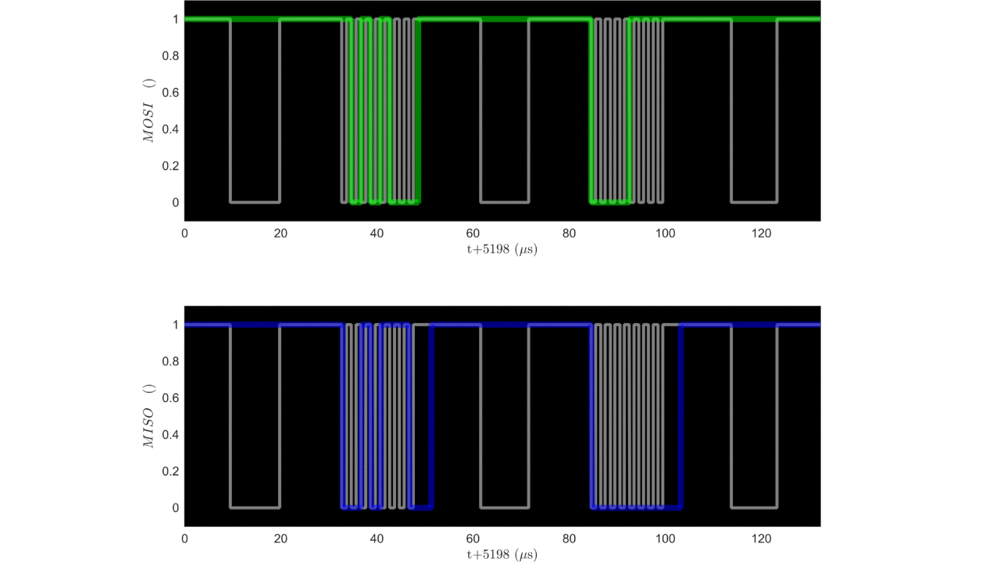

# The yiF
*a foolish combination of action cameras and SLR lenses*

## introduction 

This is a project seeking to replace an action cameras fisheye lens with one of the low cost EFs STM zoom lenses from Canon.  Ideally this combines the action camera's high frame rates with the lens' zoom, depth of field control and active image stabilisation.  Some example footage is here:

 
The lens is controlled via an Arduino micro and a Yi 4k+ was used for the action camera.  Via the arduino the lens' focus, aperture and image stabilisation motors can be controlled.  The housing is 3D printed and a commlite EF-EOSM adaptor is used for mounting the lens.

For video monitoring the Yi's in-built display combined with an optical viewfinder (the kinotehnik LCDVF 3/2) or an external hd monitor (the ikan VL35) was used.  

The system was tested with several of the EFs STM lenses (18-135 mm f3.5 and 55-250 mm f4) and a sigma 35 mm f1.4.  So far nothing bad has happened however: 

**You can apparently burn the aperture motor in Canon lenses quite easily.**

*I take no responsibility for any damage caused by the things in this repo.*

The starting point for this work was this article:

https://pickandplace.wordpress.com/2011/10/05/canon-ef-s-protocol-and-electronic-follow-focus/

from here I used a Saleae logic analyser to record the conversations between the lenses and a 650D.  These were then analysed in Matlab since in particular I needed the command to start the image stabilisation motor and activate the manual focus ring (the STM lenses are “focus by wire”).

## code

This comes in several parts

* A python class for communicating over usb (/serial port) with the arduino.
* [The arduino code](https://github.com/colinRawlings/yiFu)
* The matlab (/octave?) code for parsing the csv files generated by the logic analyser

## cad

The cad was done in Fusion (free for the first year).  The assembly is here: http://a360.co/2sxdWEE

the stl files for printing are in cad/fab.  They are only suitable for SLS nylon.

## electronics

The electronics design was done in kicad.  Note the arduino can control the power to the lens.  The entire lens is switch off after each movement of the aperture motor rather than relying on the motor off command being successfully recieved.  The gerber files are in elec/fab

